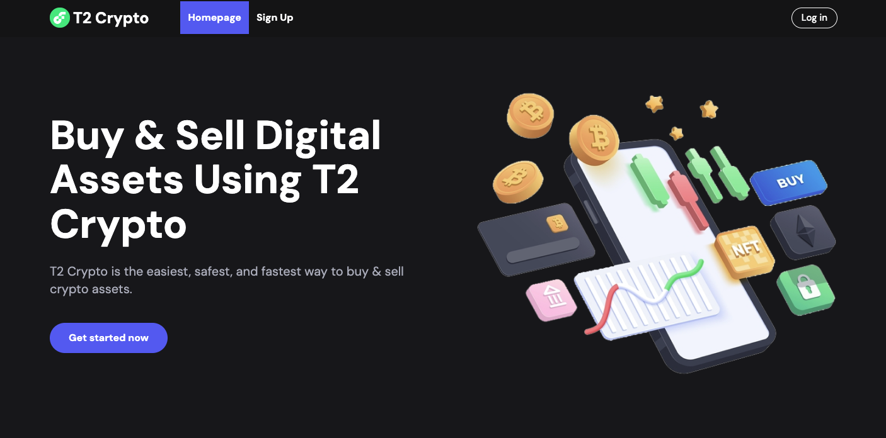
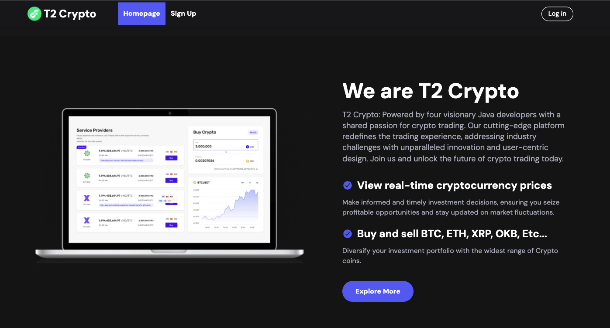
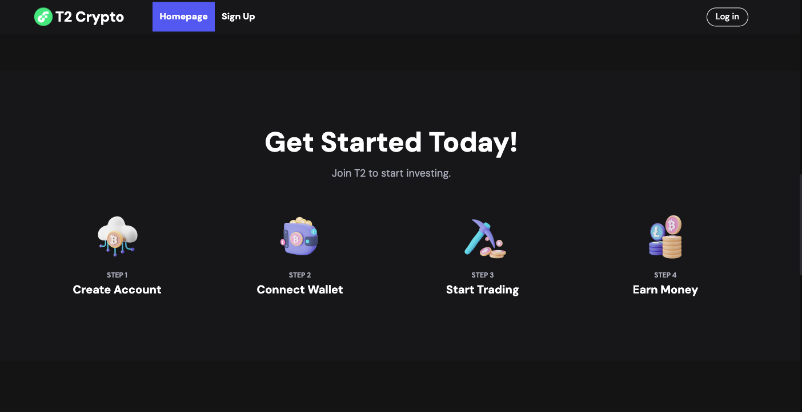
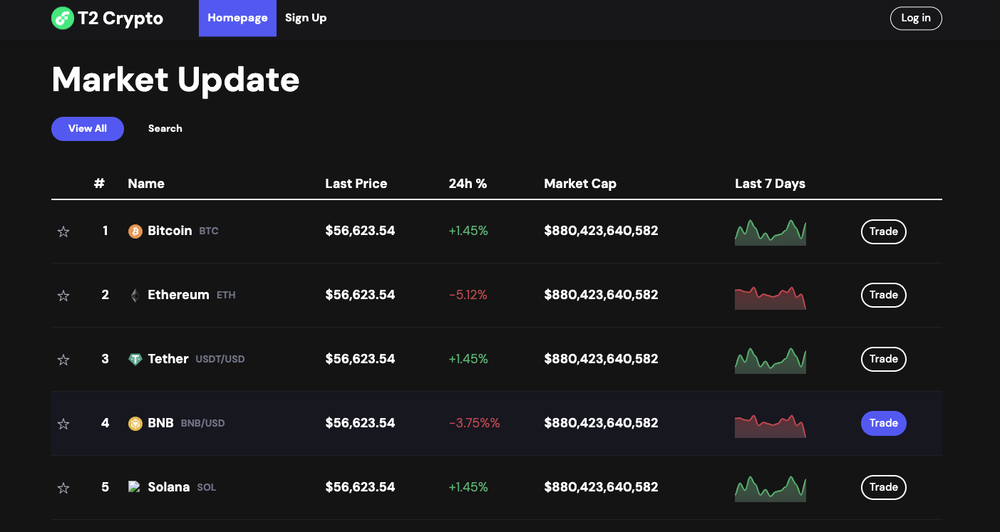

# T2Crypto
Welcome to the T2 Crypto App repository! This app is designed to simplify cryptocurrency trading and portfolio management. Whether you're a seasoned investor or new to the world of cryptocurrencies, the T2 Crypto App aims to provide you with a user-friendly platform to make informed investment decisions and track your portfolio performance.

## Features

- Real-time Portfolio Performance: View your total asset value, gains/losses, and asset allocation in real-time through an intuitive dashboard.
- Unified Portfolio Management: Manage your investments from various exchanges in one place, ensuring a centralized and streamlined experience.
- Market Insights: Stay informed about price fluctuations and historical trends through real-time market data and informative charts.

## Project Status and Future Enhancements

Please note that the T2 Crypto App is currently in its final stage as a course project. While it is functional and demonstrates the core features outlined in the project's scope, there are areas that may benefit from further refinement and enhancement. This app was developed as part of a learning exercise, and as such, some functionalities might not be fully optimized or may not represent industry best practices.

##Screenshots

